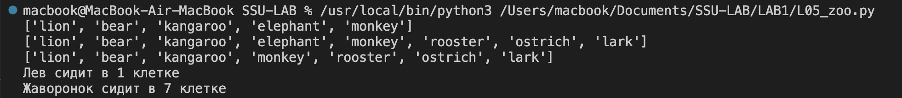
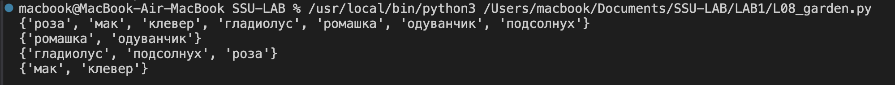

# Лабраторная работа №1

### Ход работы:

- создаем репозиторий, клонируем репозиторий через VS Codeф, переносим задания из архива в репозиторий 
- Выполнение задания 00_distance: заполняем словарь distances, по формуле и выодим его:
  

- Выполнение задания 01_circle: вычисляем площадь круга по формуле (1). Проверяется принадлежность точек (23,34) и (30,30) кругу с центром (0,0) по формуле (2). Выводим площадь с округлением с точностю до 4-х знаков после запятой и принадлежность двух точек:

$$
π*r^2 
$$

$$
\sqrt{x^2 + y^2} < R.
$$
- Выполнение задания L02_operations: мы имеем не изменяемый ряд чисел "1 2 3 4 5" , раставляя знаки ("плюс", "минус", "умножение" и скобки) в этом ряде мы должны получить 25. Используя логику и перебор знаков получаем такое выражение ((-1-2) * (-3)-4)*5=25. Выводим результат(в выоде так же присутствует 9 - это число полученное в примере выполнения задания):

- Выполнение задания L03_favorite_movies: Есть строка с перечислением фильмов, наша задача вытащиьт из него определенные фильмы, используя индексы. Выводим названия посчитав их индеккс в строке. Выодим полученные таким образом фильмы:

- Выполнение задания L04_my_family: Зполняем список  ``` my_family = ["Папа", "Мама", "Бабушка", "Дедушка"]```, а также список списков в который мы внесем рост членов семьи. Используя двойную индексацию выводим рост отца, а также суммируем рост всех членов семьи. Выводим результат:

  
- Выполнение задания L05_zoo: Имеем список животных в зоопарке ``` zoo = ['lion', 'kangaroo', 'elephant', 'monkey', ]```, добовляем медведя между львом и кенгуру используя ``` zoo.insert(1,"bear")```. К списку zoo добавляем список с птицами ```birds = ['rooster', 'ostrich', 'lark', ]```, для этого просто ставим "+" между ними. Убираем слона из списка используя ```zoo.pop(3)```. Выводим все что у нас получислось а так же в каких клетках сидят лев и жаворонок(что бы номер клетки соответствовал индексу добавляем к нему единицу):

- Выполнение задания L06_songs_list: Используются списки и словари с песнями и их длительностью, вычисляем время звучания трех песен: "Halo", "Enjoy the Silence", "Clean" . Аналогично рассчитывается время для "Sweetest Perfection", "Policy of Truth", "Blue Dress". Выводим округленные значения с точностью до 2-ух знаков после запятой:

- Выполнение задания L07_secret: Имеем зашиврованное сообщение в списке сторк, извлекая буквы согласно ключу расшифровки. Выводим полученный результат:

- Выполнение задания L08_garden: Создаются множества garden_set и meadow_set. Вычисляются:

  ​	•	Все цветы (|). ```(garden_set | meadow_set)```

  ​	•	Общие цветы (&). ```garden_set & meadow_set```

  ​	•	Только в саду (-). ```garden_set-meadow_set```

  ​	•	Только на лугу (-). ```meadow_set-garden_set```

  Выводим полученные значения:

  

- Выполнение задания L09_shopping: У нас есть словарь shops, который содержит названия магазинов и соответствующие товары с их ценами. Заполняем вручную словарь sweets, где указываем товары и соответствующие магазины с минимальными ценами. Выводим результат:

- Выполнение задания L10_store: выполняем расчёт общей стоимости товаров на складе с использованием двух словарей: goods, где хранятся названия товаров с их кодами, и store, где для каждого кода товара хранится список словарей с количеством и ценой. Для каждого товара извлекаем код из словаря goods, затем обращается к соответствующему коду в словаре store, где извлекаем информацию о количестве и цене. Суммируя количество товаров и умножая на цену, рассчитываем общую стоимость. Выводим результат:

### Сложность: *Medium*

> Напишите верхнеуровневый модуль, который будет использовать логику из модулей-заданий. Перед этим нужно будет придумать способ инкапсулировать логику для корректного импортирования.

- Создаём main.py
- В кадом задании добавляем функцию, для удобного импортирования в main.py
- Импортируем функции из кажого задания, а также переименовываем файлы заданий, так как файл не может начинаться с цифры при импорте функции (просто добовляем L в начало названия файла). Добавляем псевдонимы (алиасы ``as``) для удобства.
- Создаем в main.py функции в которой будем выводить номер задания и выводить значение определенной функции 
- При импорте модуля Python автоматически выполняет весь код в этом модуле. Если в этих модулях есть вызовы print() или другие действия, они выполняются сразу при импорте. Что бы этого избежать перед выводом в каждом задании добовляем `` if __name__ == "__main__"`` 
  - Каждый файл Python имеет специальную переменную __name__, которая определяется автоматически. Значение этой переменной зависит от того, как запускается файл: 
    - Если файл **запускается напрямую** (например, вы запускаете python my_script.py), то переменная __name__ будет иметь значение "__main__".
    - Если файл **импортируется как модуль** (например, import my_script), то переменная __name__ будет иметь значение **имя модуля**, то есть имя файла без расширения .py.

- Выводим функцию, и получаем:

- Отправляем изменения в репризиторий:
  - **cd ~/Documents/SSU-LAB** - Переход в папку с репозиторием
  - **git status** - команда, чтобы узнать, какие изменения были сделаны и готовы ли они к коммиту.
  - **git add .** — добавляем все изменения в проекте, чтобы подготовить их к коммиту.
  - **git commit -m "Лабораторная выполнена"** — создаём коммит с описанием изменений.
  - **git push origin main** — отправляем изменения на удалённый репозиторий в основную ветку

### Шпоргалка по Git:

​	1. **git init** - Инициализация нового Git-репозитория в текущей папке.

​	2. **git clone <url>** - Клонирование удалённого репозитория на ваш компьютер.

​	3. **git status** - Показать текущий статус репозитория, какие файлы изменены или добавлены.

​	4. **git add <file>** - Добавить изменения в указанный файл в индекс (staging area). Чтобы добавить все изменения, используйте git add .

​	5. **git commit -m "Сообщение"** - Создать коммит с сообщением, описывающим изменения. Например:

​	6. **git push [удалённый репозиторий] [ветка]**  - Отправить коммиты на удалённый репозиторий в указанную ветку (например, main или master).

​	7. **git pull origin <branch>** - Загрузить изменения с удалённого репозитория в указанную ветку. Обычно используется для синхронизации.

​	8. **git remote -v** - Проверить, с каким удалённым репозиторием связан локальный репозиторий.

​	9. **git log** - Показать историю коммитов.

### Список используемых источников:

1.  Шпаргалка по Git от GitHub /  [Электронный ресурс] // GitHub : [сайт]. — URL: https://training.github.com/downloads/ru/github-git-cheat-sheet/ (дата обращения: 10.02.2025). 

   

